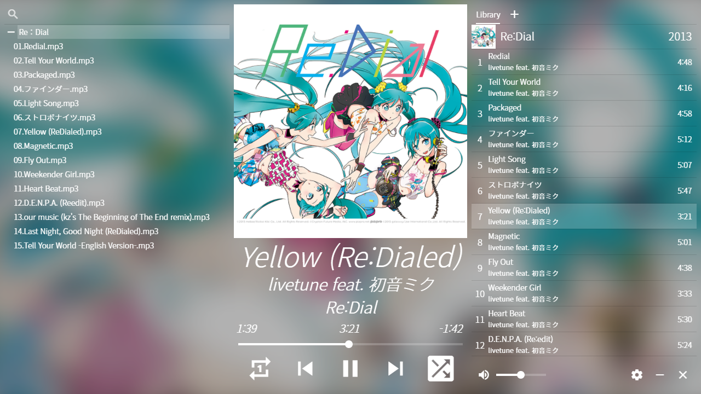

# Hatsune


English | [한국어](https://github.com/ghj1214kr/hatsune/blob/main/README_ko.md)

Desktop music player



## Download

[Download from here](https://github.com/ghj1214kr/hatsune/releases/latest).

## Instructions

### How to drag window?


Drag the marked area.

### Keyboard shortcuts

- <kbd>Space</kbd> or <kbd>Enter</kbd> : Play/Pause   
- <kbd>L</kbd> : Toggle loop   
- <kbd>S</kbd> : Toggle shuffle   
- <kbd>M</kbd> : Toggle mute   
- <kbd><</kbd> : Previous track   
- <kbd>></kbd> : Next track   
- <kbd>↑</kbd> : Volume up   
- <kbd>↓</kbd> : Volume down   
- <kbd>←</kbd> : Seek backward 5 seconds  
- <kbd>→</kbd> : Seek forward 5 seconds  

### Other functions

Right-click on cover art or playing track information to copy it to the clipboard.

### Something is going wrong!

Press <kbd>Ctrl</kbd> + <kbd>R</kbd>. Player will be refreshed. 

## Install the dependencies
```bash
yarn
```

### Start the app in development mode (hot-code reloading, error reporting, etc.)
```bash
quasar dev -m electron
```

### Build the app for production
```bash
quasar build -m electron
```

### If get an error related to `better-sqlite3`
```bash
./node_modules/.bin/electron-rebuild
```
