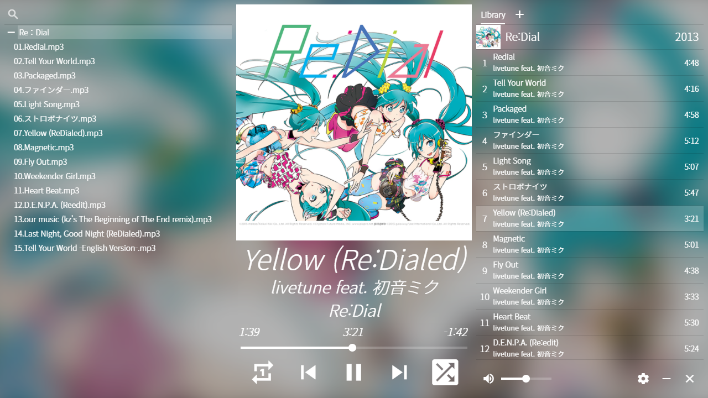
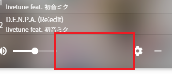

# Hatsune


[English](https://github.com/ghj1214kr/hatsune#readme) | 한국어

퀘이사 프레임워크로 만든 데스크탑 음악 플레이어



## 내려받기

[여기서 내려받으세요](https://github.com/ghj1214kr/hatsune/releases/latest).

## 업데이트

새 버전을 내려받아 기존 폴더에 덮어씌우세요.

## 설명서

### 창을 어떻게 끌어다 놓죠?



표시된 영역을 잡고 끌어주세요.

### 키보드 단축키

- <kbd>Space</kbd> 또는 <kbd>Enter</kbd> : 재생/멈춤   
- <kbd>L</kbd> : 1곡 반복 전환   
- <kbd>S</kbd> : 무작위 섞기 전환   
- <kbd>M</kbd> : 음소거 전환  
- <kbd><</kbd> : 이전 곡   
- <kbd>></kbd> : 다음 곡   
- <kbd>↑</kbd> : 음량 높이기   
- <kbd>↓</kbd> : 음량 낮추기   
- <kbd>←</kbd> : 5초 이전으로 탐색  
- <kbd>→</kbd> : 5초 다음으로 탐색  

### 기타 기능

커버 아트 또는 재생 중인 곡 정보에 오른쪽 클릭하면 클립보드에 복사할 수 있습니다.

### 뭔가 잘못됐어요!

<kbd>Ctrl</kbd> + <kbd>R</kbd>를 누르세요. 플레이어가 새로고침 됩니다.

## 의존성 설치
```bash
yarn
```

### 개발 모드로 시작 (hot-code reloading, error reporting, etc.)
```bash
quasar dev -m electron
```

### 빌드
```bash
quasar build -m electron
```

### `better-sqlite3`와 관련된 오류가 발생한 경우
`./node_modules/better-sqlite3/build/Release/better_sqlite3.node`가 존재하면 먼저 삭제
```bash
./node_modules/.bin/electron-rebuild
```
